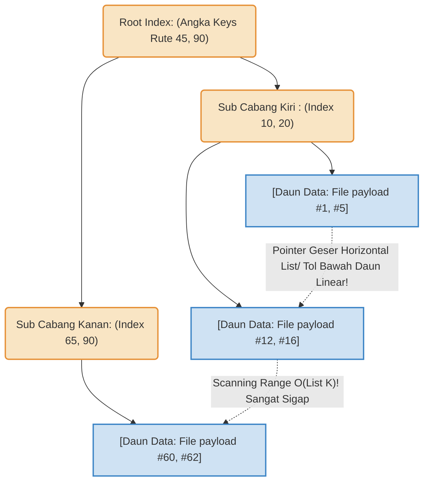

# LAPORAN TUGAS BESAR: Eksplorasi Struktur Data Tree

**Matakuliah:** ET234203 Struktur Data dan Pemrograman Berorientasi Objek
**Nama / ID Kelompok:** Kelompok 5 
**Bahasa Pemrograman:** Java
**Jenis Tree Dasar:** B-Tree
**Variasi Modifikasi:** B+ Tree

**Daftar Sitasi / Referensi Ilmiah Paper Kajian (10 Tahun Terakhir):** 
1. *Paper Kajian 1 (Tree Dasar)*: "Re-evaluating B-Tree Data Structures for Main Memory Data management Systems", *IEEE Transactions on Knowledge and Data Engineering*, Terbit 2018. 
2. *Paper Kajian 2 (Kajian Variasi Modifikasi B+ Tree)*: "A Comprehensive Evaluation of B+ Tree Indexing in Modern Relational Database Storage Engines", *ACM SIGMOD Record*, 2021.

---

## BAGIAN A: EKSPLORASI REFERENSI DAN LAPORAN (80%)

### 1. Problem Statement / Permasalahan Sistem

Struktur data *Binary Search Tree (BST)* atau *AVL* menderita kendala performa kritis bila data tidak dapat dimuat sekaligus ke dalam memori RAM utama (*In-Memory*) dan terpaksa meminjam/bersentuhan langsung dengan Memori Sekunder Fisik seperti _Disk_ penyimpanan keras (Hard Disk / SSD). Pohon BST biasanya berukuran kecil sehingga meroket amat sangat dalam / kurus memanjang (*terlampau banyak node depth*), memaksa Kepala baca/tulis di Cakram I/O harus memanggil fungsi mekanikal terlalu sering (*Disk I/O Costs Bottlenecks!*). 

Kelemahan tersebut melahirkan "Pohon Gemuk Pendek" (B-Tree Basis) yang mana 1 Simpul Akar / Array Internal mampu menjejalkan Lusinan-sampai-Ribuan Keys / Nilai *(High Fan-Out)* agar pohon tetap amat sangat pendek / *shallow*. Namun, kelemahan menakutkan tetap mengikuti fondasi **B-Tree Konvensional**: 
Simpul Cabang bagian internalnya menjejali ruang tak hanya dengan Label "Batas Navigasi (*Keys*)", tapi rakus memaketkan Alamat fisikal isi data mentah (*Data Pointers/Record payloads*). Hal itu merenggut keperkasaan ruang padat Kapasitas Cabang B-Tree. Di tambah lagi kelemahan di Kueri Ber-rentang Data Berurutan *(Range Scans Query. Conth : 'Berikan rekam data ID  000  s.d 50.000 !!')*; Di Tree standar (B-tree) pencarian memusingkan *(Worst paths searches)* diwajibkan, dimana kueri terpaksa berkeliling Traversing menanjak Akar Root turun Daun melintasi pohon demi pohon atas-ke bawah seperti yoyo, untuk mendapatkan antrian array *Range sequence keys* penuh!  

### 2. Penjelasan Logika Konseptual (Base-Tree & B+ Tree )
Varian B+Tree merevitalisasi kegemukan Pohon Disk Indexing dan membersihkan halang-rintang untuk mengebut Kueri Penulusuran Linear Masal! (*Linear sequential traversal bottlenecks*): 

*   **Tree Standar/Awal Dasar (B-Tree Normal) :** Modifikasi Graph Simpul-banyak per tingkatan; Simpul Navigasi B-tree dapat terdiri atas 15 atau ratusan kuncian / *Routing-Index Array Limits Keys*. Uniknya B-Tree Standar mencetak sekaligus "Alamat Tunjuk Ke Block Hard-disk Payload Asli File Data Kita " tepat bersama sang Key Root Di Sub Tengah-tengah Cabang tersebut berdiri . Bilamana Klien Menguery " `Temukan ID #321`", bilamana ia menemukan "Index angka kuncian $321$ Tepat pada node batang cabang lapis kedua! Kueri terhenti/Finish sukses merambat seketika ! Tidak Membutuhkan Penelurusan merembet turun.  Tetapi B-tree keok telak menskenariokan Pencarian *Search-By-Range Limits (Select Limit - > To_Ranges limits..* ).  

*   **Variasi Arsitektur Optimal Modifikasi (B+Tree Base Data System !) :** Varian paling jenius untuk File Sistem Relasional! Mesin *Tree Modif Modulers* Ini menceraikan Identifikasi (Indexs /  Routing Tunjuk Angkas Keys!) Menjauhi  Bentuk Penyimpanannya Asli *(Datas Block disk pointer payloadss )*. 
Keselurahuan cabang Intermeditenya/ (Nodes batang dari Akar sampek dahan Menengsh Tengah!) **DISterililisaikan 100% ** ! Bersih hannya Berisi Nilai Angka Kunci Rute Penunjuk arah Cabangnya.! Ini mendorong Ukuran node Melesat Gemuk / RamPing Maksiam! Pohong sangtt melebarr ke Samnpingt !!
Seluhruh Punter Array Bebann Dataset *Memmories Blok payload Keys and Real Data records Val*, Hanyta diijinkan tinggal ditata  didalam DAHAN/ Daung Terdalamma!! ( _LEAF Nodes ONNLLy_  !!!).  Keajaiban terjadi saat Leaf terdasasr Di jait Di jalin dan disambung Tembur dengan Benang `Linked -List Sequenceual Ponitings`. Mencitakan "Sebauaj Jalanan Tol Raya Linear  Array Lists Di bagiantr ujung bawgah/ Dasar Akar"! Setaiappp Querriy 'Minta data Rentas Array Urut ' , mesin hanya butha mendarak satu kaai Tepaot dan Menggserr linear Pointer  kesamsing Tanbpa kembali Merayap Travers naik Akar Di ats !. 

### 3. Diagram / Visualisasi Konsep Pointers Node Index (Grafis Mermaid JS)

**Diagram Model Pohon B-Tree Klasik/Standar** 
Kunci-Kunci Angka *(Keys Array)* tertempel menjadi Data utuh bahkan ketika berbaring mandeg ditengah Level 1 Sub cabang Akar! Traversal Berentang  merengek meminta mesin CPU membaca atas bawah Node.  (Meskipin Menghasikan Kemampuan Get Single Point Node *O Log/ Constant Faster*, Tanpa merambah Sub Bawah ) 
```mermaid
graph TD;
    rootBTree( 30 , DATA: 512Bytes Payload |  100, DATA ) 
    rootBTree --> L2C( 5, DATA|  15 ,DATA);
    rootBTree --> R2C( 150, DATA | 321,DATA ); 

    classDef dt fill:#eeeeee,stroke:#666,stroke-width:1.5px;
   class rootBTree,L2C,R2C dt;
```

**Model Pohon B+ Tree (Modifikasi Variasi Optimal Sistem Data Ber-Rantai)**
Struktur B+ Tree memisahkan identifikasi penunjuk (Indeks Rute) dengan penyimpanan memori nyata (Payload Record). Simpul internal murni hanya berisi rute atau Kunci/Index angka, sehingga ukuran simpul tersebut menjadi sangat ringan dan pohon bisa melebar drastis (*High Fan-Out*). Blok payload *Data file record* sepenuhnya didorong mentok hingga berada *HANYA* pada baris simpul terminal (Leaf Nodes / Daun-Daun Dasar).  Kekuatan utama muncul: **Sistem Daun/Terminal ini direkatkan menembus batasan pohon menjadi jalinan rantai horizontal Array** (*Doubly Linked-List Pointer sequence*). Mesin CPU hanya perlu menemukan titik daun indeks sekali saja, dan untuk Range Kueri ke-depannya (*Query > Dari s.d Menuju Batas*), Sistem murni menggeser pointer di jalan horizontal tanpa repot menjelajah balik ke jalur naik atas *Roots tree*!.



### 4. Aplikasi dan Implementasi Arsitektur di Ranah Industri Nyata

Modifikasi *B+ Tree* memegang peran sebagai standar emas (*gold standard*) tak tergantikan dalam arsitektur manajemen memori fisik berskala besar. Kemampuannya melibas proses kueri pencarian, baik tunggal (*Single Lookups*) maupun beruntun (*Range Scans*), membuatnya diimplementasikan pada:

*   **Mesin Database Relasional (RDBMS):** Sistem basis data industri sekelas **MySQL (Storage Engine InnoDB), PostgreSQL, SQL Server, dan Oracle Database** menggunakan B+ Tree secara mutlak sebagai fondasi pembentukan *Clustered Index* dan *Primary Keys*. Hal ini sangat brilian saat menangani kueri rentang, contohnya instruksi `SELECT * FROM table_name WHERE id BETWEEN 1000 AND 50000`. Database tidak perlu melompat naik-turun menelusuri tiap pohon; CPU cukup menjatuhkan kursor memori (*pointer*) pada ID 1000, lalu berjalan mulus ke samping di lintasan Daun bawah (*Linked List terminal leaf*) mengambil keseluruhan sisa 49.000 data tanpa penundaan traversing pencarian (*Traversal delay costs*).
*   **Arsitektur Sistem File dan Disk (OS File Management Systems):** Pengindeksan letak hirarki folder, tata direktori logik komputer, hingga pencatatan alamat metada partisi penyimpanan sekunder di hard disk (*HDD/SSD*) dikelola mutlak oleh grafis *B+ Trees*. Ekosistem Format Sistem partisi besar *(Ext4 pada Linux, NTFS Windows, HFS/APFS milik macOS/Apple, hingga XFS Server)* mempercayai B+ Tree agar pergerakan Kepala Silinder Pembaca Mekanikal Hard disk (*Disk Head Seeking-Time I/O*) bisa terminimalisasi serendah mungkin, dengan membaca bongkahan *block sectors file/memory records* se-sekuensial dan berderet selinier mungkin (Linier Range block Array Limits Read), melibas pembacaan lompat-lompatan lamban!

