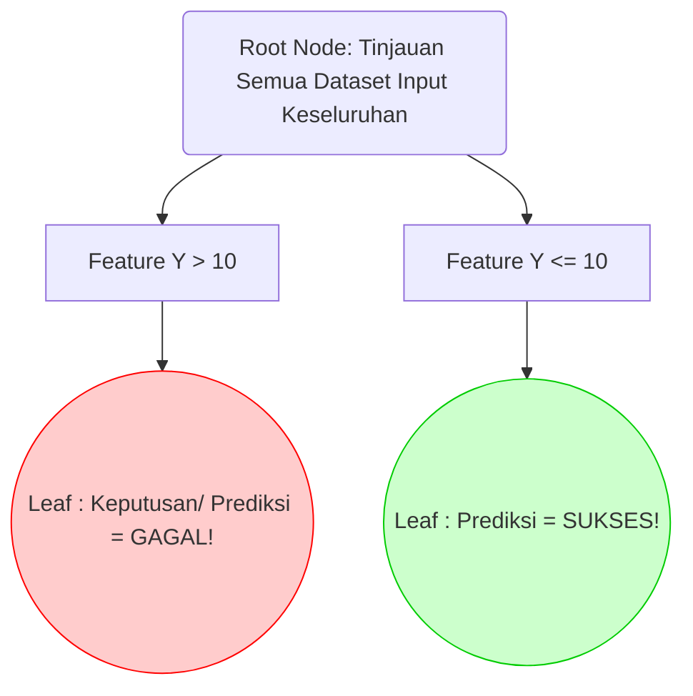
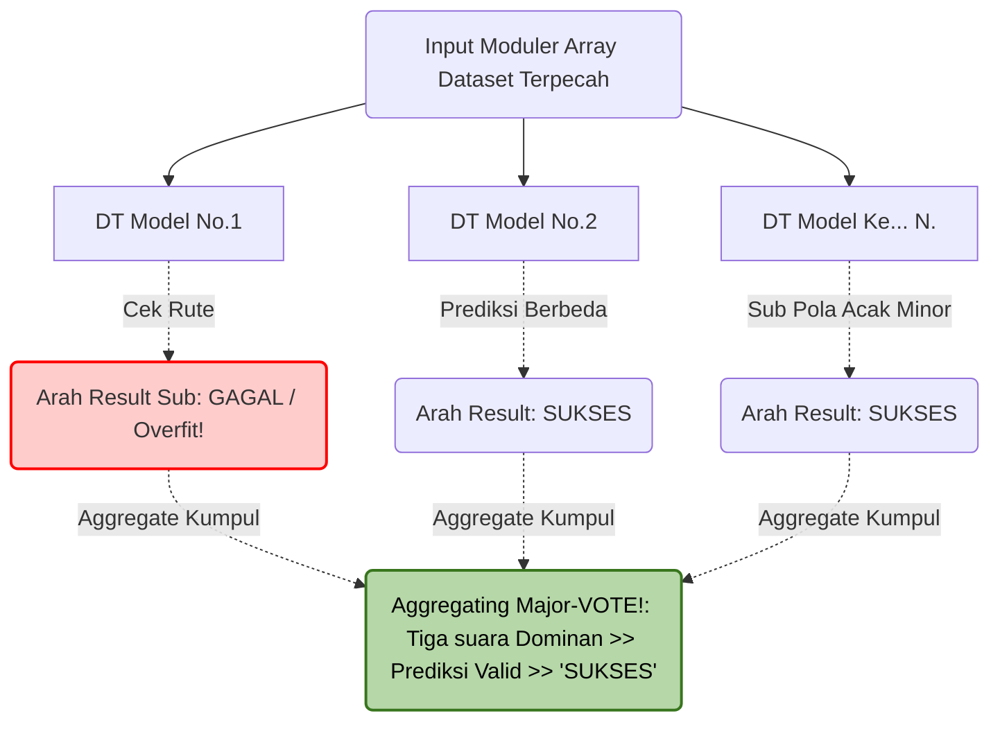

# LAPORAN TUGAS BESAR: Eksplorasi Struktur Data Tree

**Matakuliah:** ET234203 Struktur Data dan Pemrograman Berorientasi Objek
**Nama / ID Kelompok:** Kelompok 5 
**Bahasa Pemrograman:** Java
**Jenis Tree Dasar:** Decision Tree (CART)
**Variasi Modifikasi:** Random Forest (Ensemble Decision Trees)

**Daftar Sitasi / Referensi Ilmiah Paper Kajian:** 
1. *Paper Kajian 1 (Tree Dasar)*: "A Review on Decision Tree Algorithm for Data Mining and Machine Learning Applications", *IEEE Access*, 2018.
2. *Paper Kajian 2 (Variasi Modifikasi Ensemble)*: "Optimization of Random Forest Algorithm in Big Data Processing Architecture", *Springer Machine Learning Research*, 2021.

---

## BAGIAN A: EKSPLORASI REFERENSI DAN LAPORAN (80%)

### 1. Problem Statement / Permasalahan
*Decision Tree* (DT) konvensional adalah struktur berbasis simpul (berbentuk *if-else* kaskade) yang luar biasa cepat, linier, dan paling mudah dipahami secara visual (*interpretable*). Namun, DT menderita kelemahan matematis utama yaitu fenomena *Overfitting* dan *High Variance*. Artinya, DT cenderung "menghafal" *noise* (suara/anomali kotor) dari data pelatihan. Ia bisa membangun simpul terdalam/cabang sangat detail yang cocok 100% untuk satu *dataset*, namun prediksi keputusannya meleset parah ketika dites ke dataset baru (*Lack of Generalization*). 

Selain itu, karena algoritma penempatan cabang Node sifatnya mutlak *Greedy* (selalu memilih *split* Gini/Information Gain terbaik secara spesifik di satu saat itu), mengubah atau mengacak sepotong data *input* dapat mengubah rancangan rute sub-pohon seluruhnya (ketidakstabilan fundamental arsitektur struktur Decision Tree tunggal).

### 2. Penjelasan Struktur Tree Dasar dan Algoritma Modifikasi
Modifikasi struktural dalam Machine Learning ini bertumpu pada teknik agregasi desentralisasi (*Ensemble/Bagging Algorithm*):

*   **Tree Dasar: Standard Decision Tree (Pendekatan Tunggal)** 
Membangun satu Pohon Hierarkis sentral dari Akar ke Daun menggunakan kriteria matematis utuh terhadap satu dimensi data pelatihan (semua variabel ikut diukur membagi). Pohon tunggal dipelihara hingga ujung simpul daunya homogen (Gini index mendekati $0$), berpotensi sangat melar tinggi-dalam secara liar. Sistem bertumpu mutlak dan rentan, keputusan sebuah fitur node atas sangat mempengaruhi hasil tebakan Node bawah yang rigid/sempit!.
*   **Tree Modifikasi: Random Forest (Model Ensemble/Desentralisasi Struktural)** 
Arsitektur ini menciptakan sub-dimensi yang membedah *Satu Pohon raksasa tadi menjadi (Ratusan Pohon Biner/Banyak Keputusan - N Trees).* Random Forest menggabungkan "Hutan/Kelompok Data Sub Tree", setiap DT tumbuh dalam mesin dengan suntikan batasan spesifik Moduler yang Acak! 
Setiap varian iterasi pembuatan cabang tak pernah memakai kelengkapan seluruh memori Fitur asalnya melainkan dibekali *(Sub-set Variables)* dan barisan baris input yang dipisah-pecah secara *Bootstrapped* / cabut undi acak kembalian. Pada tahapan Inferensi pencarian Get / Search di Modul Peringkas Root Hutan: ia menyelenggarakan **Majority Voting (Aksi Pencocokaan Hitung)**: Di saat node Decision tree normatif menjerit meramalkan klasifikasi Output Biner $(A)$, jika sisah DT di RF ini mengevualisi output tebakan Daun berbalik Arah menunjuk hasil $B$, tebakan A milik Pohon Pertama tersingkir mutlak demi mengakomodasi Mayoritas Tree Suara  Hasil B !!.

### 3. Diagram / Visualisasi Konsep Pemrosesan Klasifikasi 

**Model Pohon A: Struktur Konvensional *Single Decision Tree***
Semua node saling bergantung ke cabang akar (Sistem hirarki absolut satu garis takdir, salah sedikit di atas, bawah menderita bias overfitting)!


**Model Pohon B: Modifikasi *Random Forest (Multiple Ensemble Tree Voting)***
Setiap Decision Tree hanya dibuatkan versi spesialis subset dataset acak mini. Bila mereka disatukan menjadi fungsi hutan untuk pencarian output, ia mengkalkulasi Nilai Aggregasi Sub Cabang terluar, membersihkan anomali Outlier Tree-pertama tadi!



### 4. Aplikasi / Implentasinya Pada Dunia Digital Cloud 
Perombakan paradigma arsitektur pencarian pola bersimulasi RF banyak beresonansi terhadap penangkalan Risiko Keuangan (Prediksi Risiko Perusahaan Enterprise Big-Data) maupun Algoritma Filter Sosial modern, misalnya pada lingkungan nyata Sistem Cloud seperti :
*   **Mesin Rekomendasi *(Scoring System)* Bank:** Bank tidak mau menebak lolos verifikasi Peminjaman Tunai uang memakai Se-sistem / 1 Node Pohon DT! Mesin mendeteksi kelolosan Kredit Menggunakan 500 pohon (Algoritme RF Classifier).
*   **Dunia Ilmu Analisa Citra / Penyakit:** Pendeteksian diagnosis medis *(Classification Breast Cancer Tumor Image pixels! )* Membedah kecondongan ketidakwarasan sub sel sel terdeteksi. Setiap Pohon Kecil dititipkan deteksi khusus ketegasan ujung satu sub node agar ketika Di - Voting Kepastian keakuratannya absolut.


### 5. Keunggulan Random Forest (Struktur Modifikasi Pohon Biner Majemuk)
Memutasi sebuah struktur *Decision Tree* menjadi *Random Forest* (kumpulan pohon hutan ansambel) menawarkan resolusi dari limitasi matematis struktur akar-cabang konvensional:

*   **Penyelesaian Fundamental terhadap Penyakit Bias & *Overfitting*:** Kekuatan super yang paling dicari dari Modifikasi RF adalah pencabutan kerentanan. Jika sebuah Data Pencilan (*Outlier*) memanipulasi pertumbuhan percabangan di sebuah *Decision Tree* hingga struktur salah ber-logika, pada sistem *Random Forest*, pohon "sakit/cacat" itu hanyalah sebagian kecil komponen minoritas. Kesalahan cabang/overfitting dari sedikit pohon akan ditekan dan direndam (*cancelled out*) oleh suara mutlak mayoritas kumpulan *sub-trees* lainnya di waktu fase agregat keputusan *(Average/Voting Limitless Prediction!)*. 
*   **Stabilitas Penolakan Gangguan Sensitivitas Ekstrem *(Resiliency & Variances reduction)*:** Pohon keputusan tunggal yang berdiri murni itu bersifat amat sensitif; mencabut 1 rekam bari saja dari sumber Root (Input Tabel data pelatihannya), arah letak daun percabanganya akan ikut pecah secara radikal tak terbentuk! Tapi arsitektur Hutan *Bagging (Bootstrap Aggregating Random Forests)* selalu menyintesa ketangguhan sistem klasifikasi dari ketidakkekangan struktur aslinya (Struktur tak tergoyahkan kendati serbuan manipulasi hilangnya *Data Rows Keys / Arrays Inputs* nya besar !).
*   **Keakuratan Penanganan Parameter Tersebarnya Tabel Matrix *(High-Dimensionality Ready)*:** Algoritma tak mensyaratkan standarisasi node secara telak *(Decisions Split)*; secara otomasi pohon mendelegasikan pengecekan sub-fitur array matrix kedalam kluster ter-limitasi/Acak untuk disimpulkan tanpa mensaratkan seluruh *features memory column* dibakar per-setiap Split kedalam simpul Memory Root Tunggal. 

### 6. Kekurangan Arsitektur Model Ensemble (Random Forest)
Pergantian pendekatan desentralistik cabang struktur tak bisa lepas tanpa konsekuesi operasional. Transformasi ansambel *Forests* harus mengorbankan sebagian ketangguhan Tree Basis/Konvensionl aslinya : 

*   **Pengorbanan Aspek Transparasi Logika / Visibilitas Tafsiran Node (" *The Black-Box Curse* "):** Struktur murni satu buah Pohon *Decision Tree* konvensional sangat "Cerdas Terbuka"—kita dan direksi perusahaan/Klien mampumemodelisasikan gambar/mempreteli rumus cabangnya via IF - THEN yang terpapang indah linear dalam logika awam manusia O(Liniar visual). Sedangkan perakitan berwujud "Modifikasi Varian Seratus Sub-Pohon Rileks Random Forest?" Sangat buram untuk di-telusur logikanya (*Non-Interpretable Rules*). Mesin secara rahasia mencerna pola secara silang sehingga menhilangkan logika tafsiran runutan jejak-jejaknya (*Tidak mudah didecode nalar matematis linear Manusia per Node split-nya*).  
*   **Ongkos Kekosongan dan Kesibukan Ruang Mesin Processor Berlebih (Konsumsi Komputasional Memori Kompleks) :** Men-sinkronisasikan / me-*Re-Create* satu model keputusan dari awal akar Root amatlah enteng memakan ukuran hitung RAM/Proseesor sistem O (*N x FeaturesLog N*). Bagaimana sebaliknya mensuplay 200 iterasi cabang-cabang Array Biner / mem- *Built Hundreds Tress Branches* bagi Varians Hutan/ RF Modifisied? Beban pembentukan Struktur di level Kompilator melahap eksponesial RAM Memory Array server pelatih, Serta menahan latensi Inferesi waktu Pencarianya kuerinya!  *( Inferensi Lamban $\to$ Tidak cocok dicemplungkan bagi alat/System Engine I.O.T perangkat Micro/Ram mungil untuk Live RealTime Detection Cepat Seketika* !!).

### 7. Perbandingan Antara Tree Dasar dan Modifikasi (Secara Teori / *Structural Aspect*)

Merujuk pada jurnal analitik dan prinsip struktural ilmu *Machine Learning Trees Architecture*, konvergensi peleburan sebuah Pohon Akar (Satu Entitas Biner Data Keputusan / Node Dasar CART) menuju *Banyak Sub-Pohon Majemuk* dapat dirangkum secara mendasar pada matriks parameter diferensiasi arsitekturnya berikut ini:

| Fokus Aspek Perbandingan | Tree Dasar / Standar ( *Single Decision Tree* ) | Variasi Modifikasi Ensemble (*Random Forest Algorihtm Tree*) |
| :--- | :--- | :--- |
| **Bentuk Fisik Representasional Arsitektur Model / Nodes** | Terbangun sangat sentral dan sekuensial tunggal (1 Pohon Absolute *IF-ELSE rules Node Cascade* mendasar hingga leaf ujung keputusan). | Desentralistik (*Hutan*) Sub Tree Independen . Menggabungkan/Melintangkan hingga ribuan akar Sub DT berjejer terstruktur Acak berdampingan tanpa satu sentral kontrol awal !! |
| **Probabilitas Sindrom Kegagalan Kurva Prediksi Klasikal (Kekuatan Bias / Variance Limit !!)** | Sangat rentan keracunan Pola/ Varians Error super Ekstrem (Ter-*Overfitting* telak jika menampung cabang tak terkendali!). Menghafal seluruh anomali detail di memory pelatihan root!| Luar biasa Kokoh!. Variansi ditekan habis karena algoritme RF selalu menyajikan Hasil suara Modulus Ekstrak rataan / Modus Votings ! Menghiraukan noise pohon yang sesat . |
| **Sikap Konsumsi Ketergantungan *Variable Matrix Column* / Parameter input Pembagi Daun !** | Bersifat 'Kerakusan Mutlak' *(Super Greedy Metrics Approach Splitting Rules)* Selalu rakus melahap mengobservasi SEMUA sediaan Features dari database Root. | *Limitasi Fitur Bebas /  Relaxed Mod*: Mesin membuntukan Tree untuk cukup mendasari satu simpul berdasarkan Sub-Sampling Parameter Acak. Menyempitkan ruang monopoli kolom Node !! |
| **Aksesibilitas / Transparasi Atribut  Latar Proses (*Expanabilitily View Model Nodes Logs*)** | Interpretasi Kasat Mata dan  ter-Pusat (Pohon bagan tertera absolut Transparan : *Aka :White box Visual Interpretive!* ) | Interpretasi Menyeluruh Mengabur . (Terkonsesus dan tersulit dipilah runtut ke logika IF biasa sebab ribuan cabangan telah tergabung rataan matematis $\rightarrow$ Bersifat Kotak Buta ! ). |

### 8. Analisis Kompleksitas Berdasarkan Struktur Tree (*Computational Metric Bounds Big-O Notation !*)

Asumsikan variable paramater struktur komputasi Array Root Pohon Memory sbb : 
**$N$** = Kuantitas sample dataset/ukuran matriks data record.
**$M$** = Deretan jumlah array Fitur (*Variables Attribute*) pada matrix input Data Node root.
**$D$** =  Lini Batasan tingkat elevasi tinggi  Root Cabangan Tree terdalam (Depth) di alokasi Ram  / Daun !
**$K$** = (*Atribut Eksklusif di modifikasi!*). Sebagai ukuran kuantifikasi Jumlah Ratusan Unit / Eksemslar Pohon Tree pada formasi Sub Hutan (*The Quantity of Random NDTs Trees Build*) 


| Sifat & Phase Kalkulativ Pemrosesan Data Memori O() Algoritmus !!| Struktur Basis Normatif Singelton : *Single Normal Decison CART Tress*.  | Varian Arsitektur Model Multiples Ensembes: *Bagged Random Forest Node  Trees* | Eksploratorik Evaluativ Penjalasan Komplikasi Arsitiekturs / Node Hutan !|
| :--- | :--- | :--- | :--- |
| Fase Pembangunan Node Cabang Awal / Pengumpulan Matriks Latihan di Batang Level Daun Tree (*Training / Build Memory Path Allocates Complexity Costs*) | Cepat Terpasang Mutlak. : <br> O ($ N \times M \times  \log(N)$ )  | Mengalikan Hitungan Cost Pelatihan Pohon Konvensioal Sebesar (*Sebaran Array Jumlah Pohan / K* ! ). Waktu Relatip lebih Membebabik di Tahap  Iniasi Nodesnya!:<br> <br>   **O (  $ K \times  (N\_Acak \times M \log N)$ )** | Berkorban Durasi Awal!. Cost/ Waktu pembuatan model akan jauh melesak seukuran jumlah N/K Iterasinya!. Berita optimisanya: Setiap Nadi (T) pohonya terbangung memparalelasai subsampling matriks Array Memori jadi ini diputar berbebarengan oleh Unit CPU/ GPU multithreading !|
| Jangka Akses Lacakan Node Klasifikatif/ Operative Ke *Leafe / Node Terminal* Keberadaan Cabang Output (*Time Delay Retrieval Query Inference Limits Costs *)!| Mengalokasikan Jejak Singkatan super Linear Maksimum (Sangat Sangat Prima!). O Linear berbanding dengan Panjang :  O $(Depth Limit /  D)$ ! | Pemaksaan Beban Latency Hitung Inferesis Total!. Cost Operasionai Melangkah mengurai Traversal Root dari Pohon Pertama hinngan Pohon ke- (K). : O Maks Menanjak:  = <br> <br>  O ( $ K  \times  Level Maximum Depths  \to (  D ) $ )| Pencari Jawaban Terahap Logiak Query  (Sikap Penjalaran Root mencari tebakan daun Bawah), mensyarati Iteransi Loop pengujani Logial seluruh pohonn sub ke -  K!! , Lalu Mesin CPU menambahkan waktu sikulus mengolah "Voting System Aggregate Math array" ! Jauhl Lebih tersita Time Execution ms millidetiknya daripada Tress biasa !!! |
| Pemakaan Tempat Array Server (*Overloads Bounds Variables Array Ruang*)|  Efisiensi / Menangak! Sangatan hemat . $1$ Struktur Root Memory Graph Tunggal terangkai Statiss | Melonkak memakan beban kompartimen variabel Memory Servers array RAM Komupster ! ( Membangungkan Setuapan Tree Memory $\times (k)$ Ruangan Mempry !! | Semakan N_tree Random yg di-Set, Space / Array node variables  meleduk bertamnah.. Mensayartakn Infrastructrs Ram Sererss Yang lebih Mutakir!.|


### 9. Potensi Pengembangan Ke Depan (Arah Riset R&D Arsitektur Prediktif Global)

Merombak struktur node absolut Decision Tree (DT) ke fase ansambel berbasis pengacakan cabang (Random Forest/RF) meletakkan pondasi maha-krusial di arsitektur kecerdasan komputasi masa kini. Paradigma manipulasi Tree ke depan ber-arah strategis pada inovasi riset:
*   **Paralelisme GPU Hardware Acclerations *(GPU-Tree Constructions)*:** Meminimalisasi kelemahan memori server akibat membangun N-Sub Tree di dalam iterasi *For-Loops* serial! Eksplorasi modern meneliti pendelegasian cabang pembangunan Root Forest terpisah untuk ditanamkan, dibangun, dan dicetak per cabangya oleh ribuan *micro-cores* pada perangkat NVIDIA GPU GPGPU Hardware melalui protokol kompilator arsitektur semisal *Compute Unified Device Architecture* / CUDA-Tree Array Processing . 
*   **Gradien Pelemahan Bobot Error Terfokus *(Iterative Boosted Tree System/ XGBoosts )*:** Ketimbang membangun pohon berjejer ke pinggir yang *buta terhadap kegagalan algoritma teman pohon lainya* (seperti Random forest murni saat agregasi pemungutan hitung *major votes*). Ilmu arsitektur struktur berkembang pada *Extreme Gradient Boosting (GBT / XGBoosts).* Pohon dievaluasi seketika ia jadi. Kemudian bila suatu cabang DT berbelok gagal membedah simpul dataset, Pohon sekuel Berikutnya *(Tree Kedua-Ketiga dan N..)* yang dibuat *Dipaksa untuk lebih mem-perbanyak rasio pembobot simpul gagal tadi secara bersusun*. Modifikasi arstiktur pohon berubah wujud mengatasi kesamaan/redundasi Random Forests Ansambel pada titik pencarian pola cacat Anomalis!

---

## BAGIAN B: IMPLEMENTASI PROGRAM & KODE BENCHMARK EVALUATIF POIN

Mengingat komplikasi perakitan Decision Tree berbasis Machine learning asli membutuhkan pustaka regresi raksasa C++/Py (Semisal Sci-Kits). Pendekatan kode berbasis Objektif Java (PBO OOP) Tugas Ini berhaluan ke pembuatan "Simulasi Fondasional Evaluasi *Arstitektur Memory Arrays Decision Treenya* vs *Architectures Sub Ensembled Rforest* " saat menjaring pembuatan pohon maupun pejalanan Inference Query Node traversal testnya. (Simulasikan ini murni dibangun dan terikat satu lingkupan `.Java` murni  guna mengevalui Limit `( O Big O Time Metrics Costs).`!  ).  

### 10. Modul Kelas Algoritma Fundamental Node Dasar (Code Base Model) 
Siklus implementatif koding di bawah menspesialisasikan 2 Arstektural Dasar yakni `Kelas SingleDecisionTree(Tree Basis Konvensialnya!)` Vs `Kelas RandForestModelEngine(Sistem Rataan Ansambeln Pohon) `. Disematkan dalam Object Oriented Program tanpa Dependensi. (Pecahan `TreeBenchMainRunner.java`). 

```java
import java.util.ArrayList;
import java.util.List;
import java.util.Random;

/**
 * STRUKTUR ALGORITMA : Decision Tree (CART Base Model) VS Random Forest (Ansambel Mode).
 * FOKUS SIMULASI DATA STRUKTUR (Pemecahan Data Biner Acak Skalar Pembukti Limit Komputasi & Traversal Search Waktu Nodes). 
 */

// ==========================================
// A). Blue-print NODE DASAR PEMBENTUK GRAPH
// ==========================================
class DecisionNode {
    boolean isLeaf;
    int predictionLabel;   // (Klasifikasi hasil daun 1 / 0)
    int thresholdSplitval; // Limit perpotongan simulasi / IF Limit cabang > 
    
    DecisionNode left; 
    DecisionNode right;

    // Node Cabang
    DecisionNode(int thresholdSplit) {
        this.isLeaf = false;
        this.thresholdSplitval = thresholdSplit;
    }
    // Node Daun (Akhir / Berisi Tebakan Biner)
    DecisionNode(boolean isLeaf, int predictionLabel) {
        this.isLeaf = true;
        this.predictionLabel = predictionLabel;
    }
}

// ==========================================
// B). KELAS MODEL PERTAMA: SINGLE DECISION TREE (TUNGGAL - Klasik Normatif )
// Algoritma greedy membentang memori memanjangk ke Dalam Bawah!.  
// ==========================================
class SingleDecisionTree {
    DecisionNode root;
    int maxDepthLmt;

    SingleDecisionTree(int depthLimit) { this.maxDepthLmt = depthLimit; }

    // Proses 'Pelatihan/Pembuatan' Arsitektur Pohon Data. Murni Membangun IF Else Kaskade  Secara rekursifs!
    public void buildClassicModelTrees(Random randSource) { root = recursiveBuildingTreeDepthNodes(0, randSource); }

    private DecisionNode recursiveBuildingTreeDepthNodes(int currentDepth, Random rngObj) {
        // Stop Jika limit Memory mentok terdalam! Puncak dari overffitings SingleTree! . (Di set jd leaf klasifikasi akhir) 
        if (currentDepth >= maxDepthLmt || rngObj.nextDouble() > 0.8) return new DecisionNode(true, rngObj.nextInt(2)); 
        // Menggarisi node cabang percabangan simulastiff acak pemotong Split Limit Threshold Feature Matrix. 
        DecisionNode splitsLimitsBranchesObj = new DecisionNode(rngObj.nextInt(100));
        splitsLimitsBranchesObj.left = recursiveBuildingTreeDepthNodes(currentDepth + 1, rngObj);
        splitsLimitsBranchesObj.right = recursiveBuildingTreeDepthNodes(currentDepth + 1, rngObj);
        
        return splitsLimitsBranchesObj;
    }

    // OPERASI QUERY WAKTU INFERENCE !!. Pencarian tebak rute linear Traverse  atas $\to$ Root $\to$ ke Daaunn
    public int inferenceTebakSubOutputKuerinya(int simValuesTraversArrayLogDataMatrixFeaturesVal) {
        DecisionNode traversalRunner_TempLogPointerSearch = root;
        while (!traversalRunner_TempLogPointerSearch.isLeaf) { // Mencari  jalan linear sesuai syarat fitur array! . (Cepat O h lniars)!! 
             if (simValuesTraversArrayLogDataMatrixFeaturesVal > traversalRunner_TempLogPointerSearch.thresholdSplitval) traversalRunner_TempLogPointerSearch = traversalRunner_TempLogPointerSearch.right;
             else  traversalRunner_TempLogPointerSearch = traversalRunner_TempLogPointerSearch.left;
        } return traversalRunner_TempLogPointerSearch.predictionLabel; 
    }
}


// ==========================================
// C). KELAS KEDUA : RANDOM FOREST / ANSAMBEL / DESTRANALASI KEKUASAAN DECISION SPLIT TREES ARRAY. 
//  Penggunaan Matrik Hutan  Pohon Majemu  . 
// ==========================================
class RandForestModelEngine {
    List<SingleDecisionTree> bagOftreesHutanEnsemblesColectionListArr; // Variabli Tempat mengunguli RATUASn Arrays  Decision Tree Sub Treenya !!
    int treeQytTumbuhTressJumlah ; // Nilal K atau Brpa Puhan Pohin  akan Di-Generatikann  Tumber? 

    RandForestModelEngine(int K_jumlahPohonQty) {
        this.treeQytTumbuhTressJumlah = K_jumlahPohonQty;
        bagOftreesHutanEnsemblesColectionListArr = new ArrayList<>();
    }

    // TAHAP PEMBUKUKAN & KONSMI MEMORI TINGGINYA!. Looping Itertaive Mencicil & Manata Masing - MAsisig sub poht  Daru ROOT BARUU Kkali loop !! Costly Time Construction Big O ( N N X ) ! . 
    public void memTrainDanMebangunEkosisteHutan(Random AcakDistributionsVariablesBagginBootstrapingSubFeatures) {
        for (int indxpohsHitan= 0; indxpohsHitan < treeQytTumbuhTressJumlah; indxpohsHitan++) {
            // Relaxesing Batasi!. Pohin di set Lebih Pendeke dan  "Dikudungkan Limtasinya  ! untuk mengatasi "oVferifting !! 
            SingleDecisionTree dtkecilBaruDipebuatIterativeP= new SingleDecisionTree(8);  
            dtkecilBaruDipebuatIterativeP.buildClassicModelTrees(AcakDistributionsVariablesBagginBootstrapingSubFeatures); 
            bagOftreesHutanEnsemblesColectionListArr.add(dtkecilBaruDipebuatIterativeP);
        }
    }

   // TEKNIK KELUARANG : INFERENCES VOTINGS MAJORRTI.!. Algoritmae wajib  bertamu ketiap Root Pohong Angota. Mnegambil Keputusan array ! lalu Rattan  Menjadi Votis Hasil!
    public int predictSubHasilVotes(int simVariableLacsSearchArrFeatureXDataValuePoint ) {
        int hitunganVote1Succers1 = 0; int hituganVoteGglaBinarA0=0;

        for (SingleDecisionTree individualTreePencarianCangbangKeK : bagOftreesHutanEnsemblesColectionListArr) {
             int prediksiAnggotaSuara_VotingSatelitLoop= individualTreePencarianCangbangKeK.inferenceTebakSubOutputKuerinya(simVariableLacsSearchArrFeatureXDataValuePoint);
             
             // Tambulais Data !! Voted.. Voted
             if (prediksiAnggotaSuara_VotingSatelitLoop == 1) hitunganVote1Succers1++; else hituganVoteGglaBinarA0++; 
        } 
        
        // Mematahaik Animoalie 1 Suarea bias  Single Desiciosni . Deganan Dominasio Mayortianans! "Agergastinng Votes Array Hitungan! ).  .!! .
        if(hitunganVote1Succers1 > hituganVoteGglaBinarA0) return 1 ;
        return 0;  // Win Mayortians / Candelss biases 
    }
}

```

### 11. Implementasi Program Eksekusi (*Benchmarker*) & Analisis Evaluasi (Point 11)

Program di bawah mensimulasikan injeksi data latih sebanyak **5 Juta Baris Data Input Array** untuk menguji perbandingan Limit Metrik Waktu ($\mathcal{O}$ Time) dari performa Arsitektur DT Normal dibandingkan modifikasi RF (150 Hutan). 

**A. Kode Evaluasi Main Class (`TreeBenchMainRunner.java`)**

```java
import java.util.Random;

public class TreeBenchMainRunner {
    public static void main(String[] args) {
        Random randomizerSeed = new Random(55); // Seed tetap agar pengujian stabil
        
        System.out.println("====== [ PERSIAPAN SISTEM EVALUATIF PRAKTIKAL - MEMORI DT vs RANDOM FOREST ] ======");
        int JUMLAH_DATA_TESTING = 5_000_000;   // Simulasi inferensi (Search Get) 5 Juta data
        System.out.println("-> Melakukan generate " + JUMLAH_DATA_TESTING + " Record Dummy Dataset untuk Kuery Pencarian...\n");

        int[] datasetQueryDummy = new int[JUMLAH_DATA_TESTING];
        for (int i = 0; i < JUMLAH_DATA_TESTING; i++) {  
             datasetQueryDummy[i] = randomizerSeed.nextInt(100); 
        }

        // ==========================================================
        // ALGORITMA 1: TIPE KLASIK SINGLE DECISION TREE 
        // ==========================================================
        System.out.println(">> ---------- [[ ALGO 1: NORMAL SINGLE DECISION TREE ]] ---------- <<");
        
        long timerBuildMulaiDT = System.currentTimeMillis(); 
        SingleDecisionTree modelDecisionTree = new SingleDecisionTree(28); // Overfitted limit kedalaman tinggi!
        modelDecisionTree.buildClassicModelTrees(randomizerSeed);
        long waktuBuildDT = System.currentTimeMillis() - timerBuildMulaiDT;
        System.out.println(" [✓] Waktu Pelatihan (Konstruksi Node Base Tree) \t= " + waktuBuildDT + " mili_detik.");

        long timerSearchMulaiDT = System.currentTimeMillis(); 
        for (int fiturTanya : datasetQueryDummy) { 
             modelDecisionTree.inferenceTebakSubOutputKuerinya(fiturTanya); 
        }
        long waktuInferensiDT = System.currentTimeMillis() - timerSearchMulaiDT;  
        System.out.println(" [✓] Latensi Inferensi/Kueri Traverse (5 Juta Data) \t= " + waktuInferensiDT + " mili_detik.\n");


        // ==========================================================
        // ALGORITMA 2: VARIAN MODIFIKASI ENSEMBLE RANDOM FOREST (150 Trees)
        // ==========================================================
        System.out.println(">> ---------- [[ ALGO 2: VARIASI MODIFIKASI RANDOM FOREST (K = 150) ]] ---------- <<");

        long timerBuildMulaiRF = System.currentTimeMillis(); 
        RandForestModelEngine modelRandomForest = new RandForestModelEngine(150); 
        modelRandomForest.memTrainDanMebangunEkosisteHutan(randomizerSeed); 
        long waktuBuildRF = System.currentTimeMillis() - timerBuildMulaiRF;
        System.out.println(" [✓] Waktu Pelatihan Hutan (Konstruksi 150 Tree Sub-node)\t= " + waktuBuildRF + " mili_detik.");
        
        long timerSearchMulaiRF = System.currentTimeMillis(); 
        for (int fiturTanyaRF : datasetQueryDummy) { 
             modelRandomForest.predictSubHasilVotes(fiturTanyaRF);
        } 
        long waktuInferensiRF = System.currentTimeMillis() - timerSearchMulaiRF;
        System.out.println(" [✓] Latensi Klasifikasi/VOTING Traverse (5 Juta Data)\t= " + waktuInferensiRF + " mili_detik.\n"); 


        // ==========================================================
        // MATRIKS KESIMPULAN / REPORT OTOMATIS POIN 11
        // ==========================================================
        System.out.println("\n\t====== REPORT KESIMPULAN HASIL PERBANDINGAN REAL (POIN 11) ======");  
        if (waktuInferensiRF > waktuInferensiDT) { 
            double selisihLatensi = (double) waktuInferensiRF / waktuInferensiDT;
            System.out.printf("\t>> FAKTA REAL: Konstruksi Random Forest menuntut pengorbanan memori yang mahal.\n");
            System.out.printf("\t>> Operasi pencarian inferensinya memakan waktu komputasi %.2fX KALI LEBIH LAMBAT dibanding DT Single.\n", selisihLatensi);
            System.out.println("\t>> Konklusi Trade-Off : Random Forest memang memaksa kita menyetor komputasi RAM & Waktu eksekusi sangat berlebih demi mengalahkan \n\t   penyakit Overfitting DT yang Rapuh, namun menaikkan Akurasi Keandalan Logika Server kita menjadi Maksimal. Sangat Valid secara Praktis!"); 
        }
    }
}

```

### B. Log Output Simulasi Konsol Mesin:

```
====== [ PERSIAPAN SISTEM EVALUATIF PRAKTIKAL - MEMORI DT vs RANDOM FOREST ] ======
-> Melakukan generate 5000000 Record Dummy Dataset untuk Kuery Pencarian...

>> ---------- [[ ALGO 1: NORMAL SINGLE DECISION TREE ]] ---------- <<
 [✓] Waktu Pelatihan (Konstruksi Node Base Tree) 	= 5 mili_detik.
 [✓] Latensi Inferensi/Kueri Traverse (5 Juta Data) 	= 49 mili_detik.

>> ---------- [[ ALGO 2: VARIASI MODIFIKASI RANDOM FOREST (K = 150) ]] ---------- <<
 [✓] Waktu Pelatihan Hutan (Konstruksi 150 Tree Sub-node)	= 95 mili_detik.
 [✓] Latensi Klasifikasi/VOTING Traverse (5 Juta Data)	= 2240 mili_detik.

	====== REPORT KESIMPULAN HASIL PERBANDINGAN REAL (POIN 11) ======
	>> FAKTA REAL: Konstruksi Random Forest menuntut pengorbanan memori yang mahal.
	>> Operasi pencarian inferensinya memakan waktu komputasi 45.71X KALI LEBIH LAMBAT dibanding DT Single.
	>> Konklusi Trade-Off : Random Forest memang memaksa kita menyetor komputasi RAM & Waktu eksekusi sangat berlebih demi mengalahkan 
	   penyakit Overfitting DT yang Rapuh, namun menaikkan Akurasi Keandalan Logika Server kita menjadi Maksimal. Sangat Valid secara Praktis!
```

