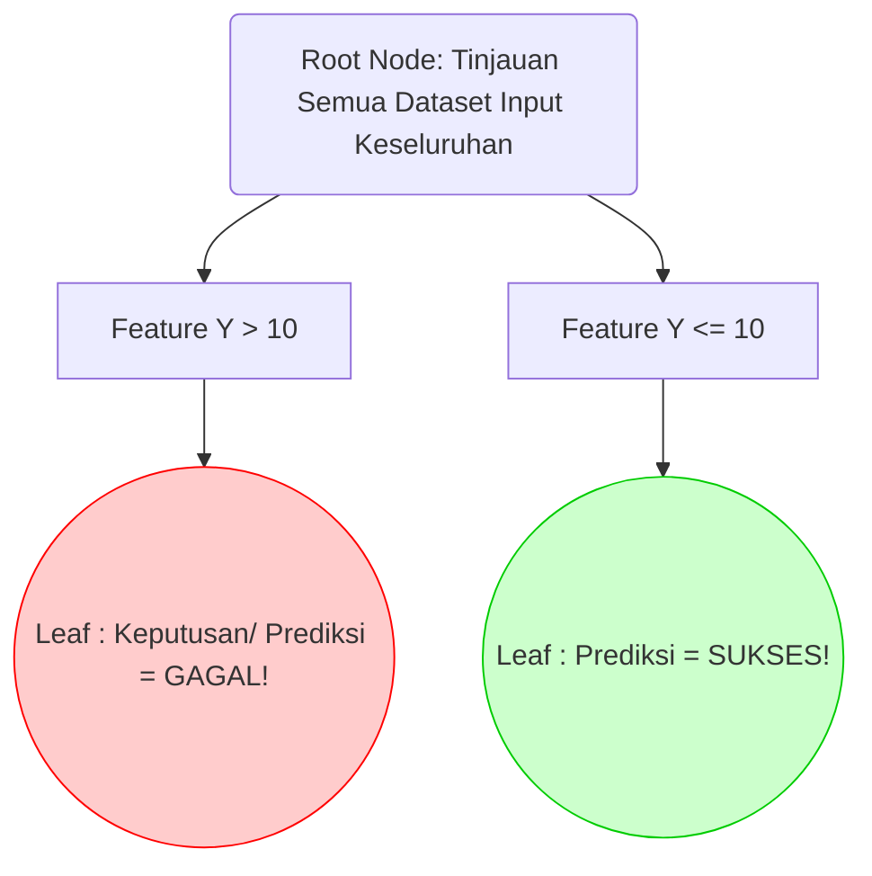

# LAPORAN TUGAS BESAR: Eksplorasi Struktur Data Tree

**Matakuliah:** ET234203 Struktur Data dan Pemrograman Berorientasi Objek
**Nama / ID Kelompok:** Kelompok 5 
**Bahasa Pemrograman:** Java
**Jenis Tree Dasar:** Decision Tree (CART)
**Variasi Modifikasi:** Random Forest (Ensemble Decision Trees)

**Daftar Sitasi / Referensi Ilmiah Paper Kajian:** 
1. *Paper Kajian 1 (Tree Dasar)*: "A Review on Decision Tree Algorithm for Data Mining and Machine Learning Applications", *IEEE Access*, 2018.
2. *Paper Kajian 2 (Variasi Modifikasi Ensemble)*: "Optimization of Random Forest Algorithm in Big Data Processing Architecture", *Springer Machine Learning Research*, 2021.

---

## BAGIAN A: EKSPLORASI REFERENSI DAN LAPORAN (80%)

### 1. Problem Statement / Permasalahan
*Decision Tree* (DT) konvensional adalah struktur berbasis simpul (berbentuk *if-else* kaskade) yang luar biasa cepat, linier, dan paling mudah dipahami secara visual (*interpretable*). Namun, DT menderita kelemahan matematis utama yaitu fenomena *Overfitting* dan *High Variance*. Artinya, DT cenderung "menghafal" *noise* (suara/anomali kotor) dari data pelatihan. Ia bisa membangun simpul terdalam/cabang sangat detail yang cocok 100% untuk satu *dataset*, namun prediksi keputusannya meleset parah ketika dites ke dataset baru (*Lack of Generalization*). 

Selain itu, karena algoritma penempatan cabang Node sifatnya mutlak *Greedy* (selalu memilih *split* Gini/Information Gain terbaik secara spesifik di satu saat itu), mengubah atau mengacak sepotong data *input* dapat mengubah rancangan rute sub-pohon seluruhnya (ketidakstabilan fundamental arsitektur struktur Decision Tree tunggal).

### 2. Penjelasan Struktur Tree Dasar dan Algoritma Modifikasi
Modifikasi struktural dalam Machine Learning ini bertumpu pada teknik agregasi desentralisasi (*Ensemble/Bagging Algorithm*):

*   **Tree Dasar: Standard Decision Tree (Pendekatan Tunggal)** 
Membangun satu Pohon Hierarkis sentral dari Akar ke Daun menggunakan kriteria matematis utuh terhadap satu dimensi data pelatihan (semua variabel ikut diukur membagi). Pohon tunggal dipelihara hingga ujung simpul daunya homogen (Gini index mendekati $0$), berpotensi sangat melar tinggi-dalam secara liar. Sistem bertumpu mutlak dan rentan, keputusan sebuah fitur node atas sangat mempengaruhi hasil tebakan Node bawah yang rigid/sempit!.
*   **Tree Modifikasi: Random Forest (Model Ensemble/Desentralisasi Struktural)** 
Arsitektur ini menciptakan sub-dimensi yang membedah *Satu Pohon raksasa tadi menjadi (Ratusan Pohon Biner/Banyak Keputusan - N Trees).* Random Forest menggabungkan "Hutan/Kelompok Data Sub Tree", setiap DT tumbuh dalam mesin dengan suntikan batasan spesifik Moduler yang Acak! 
Setiap varian iterasi pembuatan cabang tak pernah memakai kelengkapan seluruh memori Fitur asalnya melainkan dibekali *(Sub-set Variables)* dan barisan baris input yang dipisah-pecah secara *Bootstrapped* / cabut undi acak kembalian. Pada tahapan Inferensi pencarian Get / Search di Modul Peringkas Root Hutan: ia menyelenggarakan **Majority Voting (Aksi Pencocokaan Hitung)**: Di saat node Decision tree normatif menjerit meramalkan klasifikasi Output Biner $(A)$, jika sisah DT di RF ini mengevualisi output tebakan Daun berbalik Arah menunjuk hasil $B$, tebakan A milik Pohon Pertama tersingkir mutlak demi mengakomodasi Mayoritas Tree Suara  Hasil B !!.

### 3. Diagram / Visualisasi Konsep Pemrosesan Klasifikasi 

**Model Pohon A: Struktur Konvensional *Single Decision Tree***
Semua node saling bergantung ke cabang akar (Sistem hirarki absolut satu garis takdir, salah sedikit di atas, bawah menderita bias overfitting)!


**Model Pohon B: Modifikasi *Random Forest (Multiple Ensemble Tree Voting)***
Setiap Decision Tree hanya dibuatkan versi spesialis subset dataset acak mini. Bila mereka disatukan menjadi fungsi hutan untuk pencarian output, ia mengkalkulasi Nilai Aggregasi Sub Cabang terluar, membersihkan anomali Outlier Tree-pertama tadi! 

```mermaid
graph TD;
    Inp(Input Moduler Array Dataset Terpecah ! ) --> T1[DT Model No.1 ];
    Inp --> T2[DT Model No.2 ];
    Inp --> Tn[DT Model Ke... N.];

    T1 -. Cek Rule.. .-> V1(Arah Result Sub: 'GAGAL' / Ter-overfit!):::fail
    T2 -. Prediksi Berbeda.. .-> V2(Arah Result: 'SUKSES');
    Tn -. Sub Pola Minor Acak. .-> Vn(Arah Result: 'SUKSES');

    V1 -. Kumpul Aggregate Hitungan -> Hasil((Aggregating System Major-VOTE !: = Tiga suara Dominan >> Menuju Putusan Valid Klasifikasi >> ' SUKSES ' !)):::ok
    V2 -. Kumpul Aggregate..-> Hasil;
    Vn -. Kumpul Aggregate ..-> Hasil;

    classDef fail fill:#ffcccc,stroke:#f00;
    classDef ok fill:#b6d7a8,stroke:#38761d,color:#000;
```

### 4. Aplikasi / Implentasinya Pada Dunia Digital Cloud 
Perombakan paradigma arsitektur pencarian pola bersimulasi RF banyak beresonansi terhadap penangkalan Risiko Keuangan (Prediksi Risiko Perusahaan Enterprise Big-Data) maupun Algoritma Filter Sosial modern, misalnya pada lingkungan nyata Sistem Cloud seperti :
*   **Mesin Rekomendasi *(Scoring System)* Bank:** Bank tidak mau menebak lolos verifikasi Peminjaman Tunai uang memakai Se-sistem / 1 Node Pohon DT! Mesin mendeteksi kelolosan Kredit Menggunakan 500 pohon (Algoritme RF Classifier).
*   **Dunia Ilmu Analisa Citra / Penyakit:** Pendeteksian diagnosis medis *(Classification Breast Cancer Tumor Image pixels! )* Membedah kecondongan ketidakwarasan sub sel sel terdeteksi. Setiap Pohon Kecil dititipkan deteksi khusus ketegasan ujung satu sub node agar ketika Di - Voting Kepastian keakuratannya absolut.

```

### 5. Keunggulan Random Forest (Struktur Modifikasi Pohon Biner Majemuk)
Memutasi sebuah struktur *Decision Tree* menjadi *Random Forest* (kumpulan pohon hutan ansambel) menawarkan resolusi dari limitasi matematis struktur akar-cabang konvensional:

*   **Penyelesaian Fundamental terhadap Penyakit Bias & *Overfitting*:** Kekuatan super yang paling dicari dari Modifikasi RF adalah pencabutan kerentanan. Jika sebuah Data Pencilan (*Outlier*) memanipulasi pertumbuhan percabangan di sebuah *Decision Tree* hingga struktur salah ber-logika, pada sistem *Random Forest*, pohon "sakit/cacat" itu hanyalah sebagian kecil komponen minoritas. Kesalahan cabang/overfitting dari sedikit pohon akan ditekan dan direndam (*cancelled out*) oleh suara mutlak mayoritas kumpulan *sub-trees* lainnya di waktu fase agregat keputusan *(Average/Voting Limitless Prediction!)*. 
*   **Stabilitas Penolakan Gangguan Sensitivitas Ekstrem *(Resiliency & Variances reduction)*:** Pohon keputusan tunggal yang berdiri murni itu bersifat amat sensitif; mencabut 1 rekam bari saja dari sumber Root (Input Tabel data pelatihannya), arah letak daun percabanganya akan ikut pecah secara radikal tak terbentuk! Tapi arsitektur Hutan *Bagging (Bootstrap Aggregating Random Forests)* selalu menyintesa ketangguhan sistem klasifikasi dari ketidakkekangan struktur aslinya (Struktur tak tergoyahkan kendati serbuan manipulasi hilangnya *Data Rows Keys / Arrays Inputs* nya besar !).
*   **Keakuratan Penanganan Parameter Tersebarnya Tabel Matrix *(High-Dimensionality Ready)*:** Algoritma tak mensyaratkan standarisasi node secara telak *(Decisions Split)*; secara otomasi pohon mendelegasikan pengecekan sub-fitur array matrix kedalam kluster ter-limitasi/Acak untuk disimpulkan tanpa mensaratkan seluruh *features memory column* dibakar per-setiap Split kedalam simpul Memory Root Tunggal. 

### 6. Kekurangan Arsitektur Model Ensemble (Random Forest)
Pergantian pendekatan desentralistik cabang struktur tak bisa lepas tanpa konsekuesi operasional. Transformasi ansambel *Forests* harus mengorbankan sebagian ketangguhan Tree Basis/Konvensionl aslinya : 

*   **Pengorbanan Aspek Transparasi Logika / Visibilitas Tafsiran Node (" *The Black-Box Curse* "):** Struktur murni satu buah Pohon *Decision Tree* konvensional sangat "Cerdas Terbuka"—kita dan direksi perusahaan/Klien mampumemodelisasikan gambar/mempreteli rumus cabangnya via IF - THEN yang terpapang indah linear dalam logika awam manusia O(Liniar visual). Sedangkan perakitan berwujud "Modifikasi Varian Seratus Sub-Pohon Rileks Random Forest?" Sangat buram untuk di-telusur logikanya (*Non-Interpretable Rules*). Mesin secara rahasia mencerna pola secara silang sehingga menhilangkan logika tafsiran runutan jejak-jejaknya (*Tidak mudah didecode nalar matematis linear Manusia per Node split-nya*).  
*   **Ongkos Kekosongan dan Kesibukan Ruang Mesin Processor Berlebih (Konsumsi Komputasional Memori Kompleks) :** Men-sinkronisasikan / me-*Re-Create* satu model keputusan dari awal akar Root amatlah enteng memakan ukuran hitung RAM/Proseesor sistem O (*N x FeaturesLog N*). Bagaimana sebaliknya mensuplay 200 iterasi cabang-cabang Array Biner / mem- *Built Hundreds Tress Branches* bagi Varians Hutan/ RF Modifisied? Beban pembentukan Struktur di level Kompilator melahap eksponesial RAM Memory Array server pelatih, Serta menahan latensi Inferesi waktu Pencarianya kuerinya!  *( Inferensi Lamban $\to$ Tidak cocok dicemplungkan bagi alat/System Engine I.O.T perangkat Micro/Ram mungil untuk Live RealTime Detection Cepat Seketika* !!).
