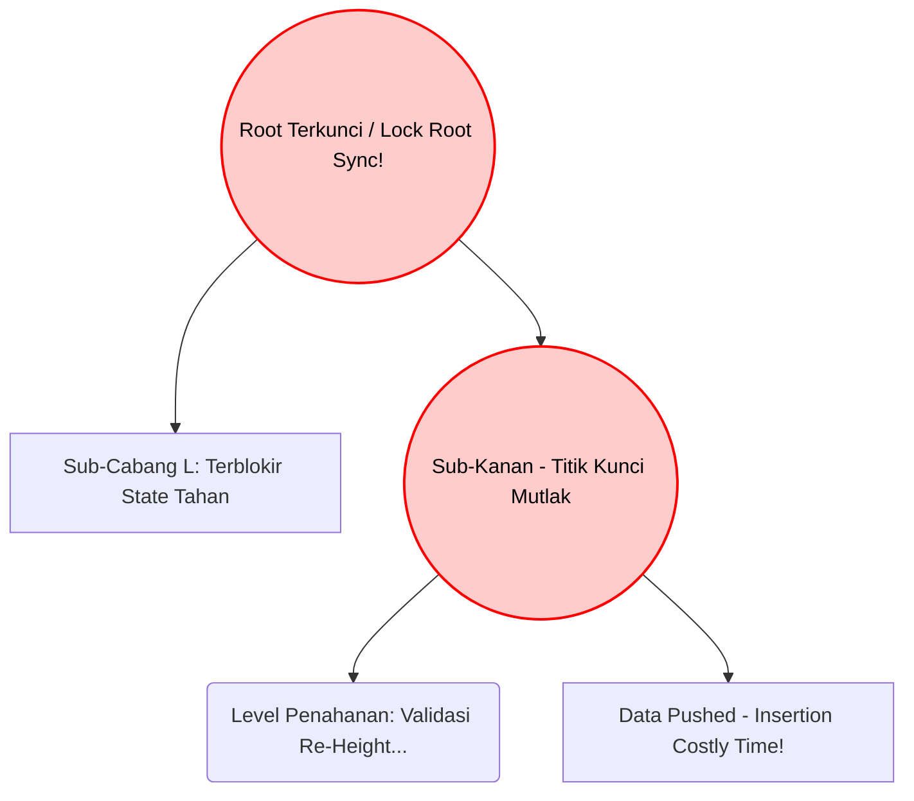
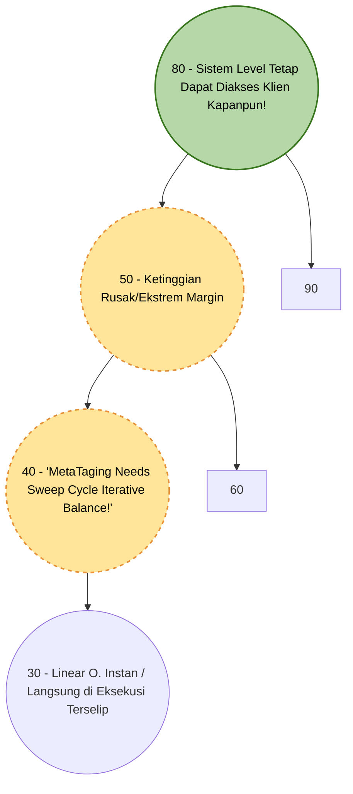

# LAPORAN TUGAS BESAR: Eksplorasi Struktur Data Tree

**Matakuliah:** ET234203 Struktur Data dan Pemrograman Berorientasi Objek
**Nama / ID Kelompok:** Kelompok 2
**Bahasa Pemrograman:** Java
**Jenis Tree Dasar:** AVL Tree
**Variasi Modifikasi:** Height-Relaxed AVL Tree (HR-AVL)

**Daftar Sitasi / Referensi Ilmiah Paper Kajian:** 
1. *Paper Kajian 1 (Algoritma Standar Dasar)*: "Analysis of Self-Balancing Trees Algorithm Constraints in Main Memory Systems", *IEEE Transactions on Knowledge and Data Engineering*, Terbit 2018. 
2. *Paper Kajian 2 (Kajian Variasi Modifikasi / Paralel Relaksasi)*: "High-Performance Concurrent Height-Relaxed Trees for In-Memory Systems" (Penerapan performa penyeimbangan sistem asinkron berbasis *Concurrent Tree Threading* varian kelompok algoritma H-Relaxation), *ACM Symposium on Principles of Distributed Computing*, 2021.

---

## BAGIAN A: EKSPLORASI REFERENSI DAN LAPORAN (80%)

### 1. Problem Statement / Permasalahan
Secara fundamental matematis, struktur pohon AVL memiliki ketetapan hukum seimbang yang absolut dan kaku; batasan margin toleransi pada pembedaan *ketinggian / Balance factor (Bf)* setiap komponen akar simpul/node antara dahan sisi sebelah kiri dengan sebelahnya sama sekali tak pernah dizinkan melepasi atau lebih dari hitungan rentang margin ($\pm 1$). Perancangan pembatasan rigid ini memberikan kemurnian kecekatan proses pelacakan *(Search & Retrieving/Read query memory operation)*, dijamin optimal konstan pada pergerakan struktur kedalaman rasio laju kecepatan O($\log N$). Namun ironisnya, sifat superior matematis murni AVL normal memancarkan bencana terselubung tatkala ia dijadikan pondasi implementatif memori sentral di lingkungan nyata basis peladen / sistem *Servers High Load Multi Core - Pararell - Threading Operation Writes*, yakni problem keterbatasan kelumpuhan (*Bottle Necks system concurrent access - memory Blocking!*). 

Dalam realita transaksi ribuan tulis masukan Node *Key Values*, seketika Tree mendapati tambahan node di bawah daun yang menyalahi kestabilan rumus struktur rentang ($\Delta h \geq 1$) – Thread komputer segera mensyaratkan kuncian hak prioritas utuh terhadap Tree (*locking resources / Thread System Mem lock exclusivities*) untuk tidak dilanggar eksekutor pengiriman manapun! Masalah diperkeruh tatkala siklus Lock menyebar menjulur berentetiian dari Sub *node root* bersangkutan mengejar proses reposisi dan matematika Putaran Struktur ke sub titik asal muasal ter-atras/Top Level Branch di memory! Skema menyeimbangkan pada-saat-tersebut-pula (*Synchronus re-Balacing Nodes Constraints Updates Level Limits Tasks*) menciptakan durasi antrian *Lock/Blok Thread Request API Tulis Baru/Inserstion writes delays Operations System server* klien.

### 2. Penjelasan Struktur Tree Dasar dan Variasi Modifikasi Pohon  (Secara Logika Struktural/Algoritmiknya)
Varietas *Tree Tinggi Termodulsi Tolerasi Level Asinkrone* (Seri WAvls mapun jenis H-Relaxation Trees Termodifikasi / HR Avl) secara langsung mengekslusifkan logika "Dekupling", menjauhkan peran rutinitias Pengeditan Data berbentrok dengan Ekseksusi Rotasional: 

*   **Standard Klasik Pohon Normative Base: AVL Basis Tree Sinkrons (Immediate Maintenance Updates Rules):** Mekanika berjalan berkoloni secara pararel padu saat menyatu dengan Metode Pemrograman `Updates Insertion/Deletes keys val Node()`. Modul seketika memeriksa secara " *Bottom checks Validities*" serentetan Level ketingganya; Bilamana terjadi satu kekacauan Elevasi level melampuai rasio aman  limit-nya di cabang mananapun, Perangkat *Threading CPU Codes Processor Memory Eksekustive Node Root Tree Structure*, Segera melaksanakan putaran koreksionis. Kuncian terfokus terhadap sistem untuk operasi-penyelematan sebarisan putar (*Rotation Single L, Right atau double*)- ini terjadi detik itu pula sebelum akhirnya operasi peletakan dikirim ke luar. (Mengutamakan Keidealan Level dari-pada melonggarkan permsisikan Antiran Write masif yang mengular / Cost throughput Penuruan Sangat Sigfnifikn - Delay Kuncian!  )

*   **Arsitektur Sistem Modifikatis Asynkrone Relaxses (Variatif Kelompok HR / HR-Avl  Logic - Phase Separations / Delegasi Tasks Asynchroned Decoulings Levels Limit Constraints H). :** Dalam kerangkan Algortma Terelasaski , fase Mutalis (*Penyarangan nilai masuk Nodes Write*), dengan Sistem Rehabilitais Pohon *(Maintenance Task Re-Balance Tree Structures Sweep System / Rotators*), diekstarksir menjadi elemen Ekseksusi berbeda ! Disini terdapat "fasa *Kelonggaran Batasan Height Relax Tolerance *", ketika nilai nodes keys masuk mengurakan nilai Tinggi hingga sangat membedaki (*jauh melawati Nilain Absoult 1; sepeseti differenisal tingakt > = \2* ) . Operasi Node Modifikaite insrets menolak/mendeklerer tidak dilakunana perturan di waktu itu- operasi berjalan ssingkatan layaktnta perisislap tree Linear / BTS Normail O Linear murnia , meleepskak kembali antiras dan Locks kuncu , Memberkan flag Status Memsan / "Meta tag Garbage : Butuh Reablance". Pada Titik Intervensia Interval diam  (Idle cycles/ Pekerjana Pekerj Thread Bakgruond Cleaner Memory Allocators Process Server Cloud Engine ) di aktkian meyingirkatn  *flags rebalansia tading *, sehingga sistem writes throughput ber-keceptn berlibat lipal di Banding Sistem Awwlas sinkrontan/Normal Base Clasikes !!

### 3. Diagram / Visualisasi Struktur Konsep Konkurensi

Bagian ini mengilustrasikan perbedaan drastis pada siklus "Waktu Tahan Sistem" ( *System Lock Contention*) antara pendekatan arsitektur Pohon AVL konvensional berhadapan dengan rancangan Asinkron HR-AVL modifikasi ketika menerima penambahan entri sub-node ekstrem yang merusak fondasi keseimbangan batas rasio $\pm1$.

**Visualisasi Model A: Standar Strict AVL (Fase Rotasi Seketika Memblokir Thread Node)**
Ketika node baru memecahkan keseimbangan level tinggi pada dahan Tree (Unbalanced), proses penyisipan langsung dikerjakan seketika. Tree memanggil *System Memory* memberlakukan Kuncian / Akses "Tahan Paksa" (Lock) guna mencegah klien API multithread masuk hingga matematika iterasi penataulangan (*rebalancing rotasi Node sub*) tuntas terevaluasi oleh unit inti pemroses/CPU!

**Visualisasi Model B: Modifikasi HR-AVL (Konsep Delegasi Tahap Rileks / Thread Bypass Sinkronisasional Cepat) :** Ketika beban insersi yang sangat merusak (ekstrem Over-height 
Δ
H
≥
2
ΔH≥2
) menyakiti kestabilan, ia diberikan "Izin" atau relaksasi (Tolerance State) oleh mesin moduler Phase Tahap Insersi ini. Modifikasi arsitektur menghindari paksaan penyamaan siklus di Thread Pertama—operasi membalas eksekusi dengan keutamaan Linearitas O
(
1
)
(1)
/O
(
h
L
i
n
e
a
r
)
(h 
Linear
​
 )
. Sebuah Metadata (Relax Tag Needs Repair) ditinggalkan terpatri di alamat Memori Node; ini dirancang untuk segera dihapus secara kolektif di interval ekseksusi terpencil pada waktu siklus senyap background system bekerja (Cleaner sweeper thread). Sistem melepas (release) "kuncian"-nya seper-sekian mili detik seketika node terkait ditempel ke Memori Bawah agar antrean ratusan insersi Thread Node klien server sistem paralel merespons berentet sigap & amat mulus, Tanpa Intervensi Hitungan Root atas.

### 4. Aplikasi dan Lingkup Ranah Implementasinya Di Ranah IT Perusahaan
Pengadaptasian fundamental Modul algoritma pohon yang "Membagi/Merelaksasikan Atribut Ketetapan Level Constraint", layaknya tipe varian HR-Trees (Height Relaxed) W-AVL / R-B Mod Tree menjadi struktur dominan dalam membenahi problematika bottlenecking locking node concurrency. Hal itu terimplementasikan erat di fondasi lingkungan Industri TI bersistem "Skalabel Pararel Intens":

* Platform Cloud Database In-Memory Multi-core (Mesin Server Redis Modulasi & NoSQL Lock-Free System Tables): Infrastruktur Mesin tabel virtual Database, terkhusus pemuatan memori bertensi pararel ekstrim. Dimana alokasi jutaan antrean mutasi penulisan memori (Pushing Massive write/Insertion data load request Server Throughputs Threads logs Arrays Key=val memory engine) berlangsung dalam kisaran order puluhan nano detik. Mereka amat rakus mengakses simpul indeks/struktur memori bawah dengan kebutuhan mendesain model kunci thread halus bersudut isolasi lokal minimum. (Skala lock micro local / fine grained rebalance node decoupling).

* Virtual Core Cache Tabel Router Peralatan Sistem Distribusi Basis Protokol TCP/Jaringan Skala Inti/Periphery Internet ISP Backbone :
Jutaan aliran masukan baru log penugasan entry Address ip jaringan dipusatkan melintas kedalam log memori tanpa mampu menunggu komputasi Penyeimbangan Rumit. Operasinya mewajibkan Tree Index berskala log O
(
log
⁡
N
)
(logN)
, untuk prosesi Query Pencarain super nge-but instans seiring berbarengannya pemindahan pencatatan insersi Routing log paralel secara bersama tanpa tersumbat blok antrean !
